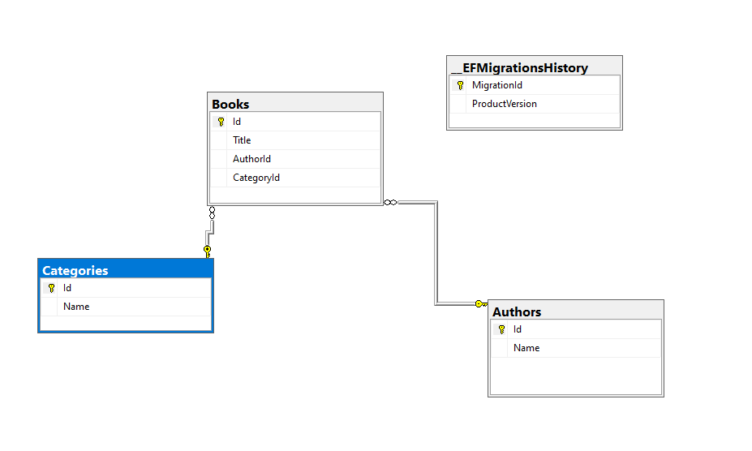
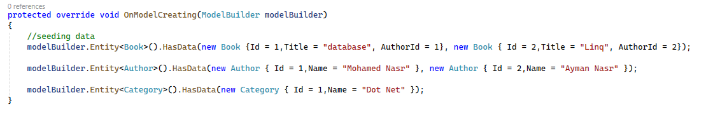

# Crud Operations 
This project is about CRUD operations , i created Book , Author and Category domain classes and as tables in database usin asp.net core 8 web api

## Content 
  * [Features](#features)
  * [Technologies](#technologies)
  * [Installation](#installation)
  * [Configuration](#configuration)
  * [Database Schema](#database-schema)
  * [Tables](#tables)

## Features
  * CRUD operations for Author domain class
  * CRUD operations for Book domain class
  * CRUD operations for Category domain class

## Technologies

  * Asp.net core 8 web api
  * Entity Framework Core as ORM
  * Linq  to write queries directly within C#
  * Sql Server as DBMS
  * Automapper : automatically maps properties from one object to another based on property names
  * Seeding Date within Ef Core
  * Repository Pattern
  * UnitOfWork (UOW) Pattern
  * DTOs : data transfer between layers


## Installation
1. Clone the Repo:
    ```bash
    git clone https://github.com/mohamedNasr99/CrudWebApi.git
    ```
2. Restore packages:
    ```bash
    git restore
    ```

## Configuration
``` c#
{
  "Logging": {
    "LogLevel": {
      "Default": "Information",
      "Microsoft.AspNetCore": "Warning"
    }
  },
  "AllowedHosts": "*",
  "ConnectionStrings": {
    "DefaultConnectionString": "Data Source=MOHAMED-NASR\\SQLDEV1;Initial Catalog=bookDb;Integrated Security=True;Connect Timeout=30;Encrypt=False;Trust Server Certificate=True"
  }
}
```

## Database Schema


## Tables
 * Author
   * Id
   * Name
 * Book
   * Id
   * Name
   * authorId
   * categoryId
 * Category
   * Id
   * Name

## Seed Data
### Seeding data within Entity framework core


